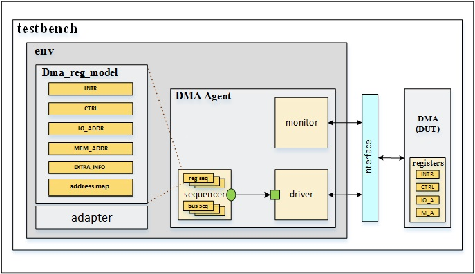
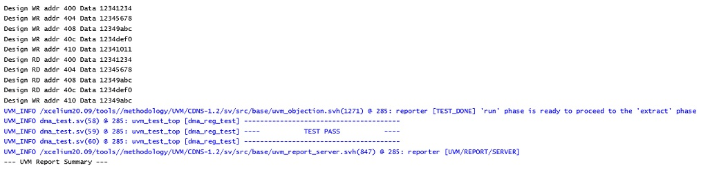

# UVM RAL using a DMA Design

The implementation shows one of the ways to access DUT registers with the UVM RAL Model.

Below are the DMA registers from DUT:
\
INTR
\
CTRL
\
IO_ADDR
\
MEM_ADDR
\
EXTRA_INFO

Below is the block diagram for the testbench:

The testbench components are:

- Environment

- DMA Agent:
\
Driver
\
Monitor
\
Sequencer and Sequences
   
- RAL Model:
\
DMA Reg package
\
Adapter

The provided design has some changes compared to the reference model such as adding an extra register called extra_info with the address of 410.
 
*Output console:*

  

  
Reference:
--   
https://verificationguide.com/uvm-ral-example/uvm-ral-example-dma/
